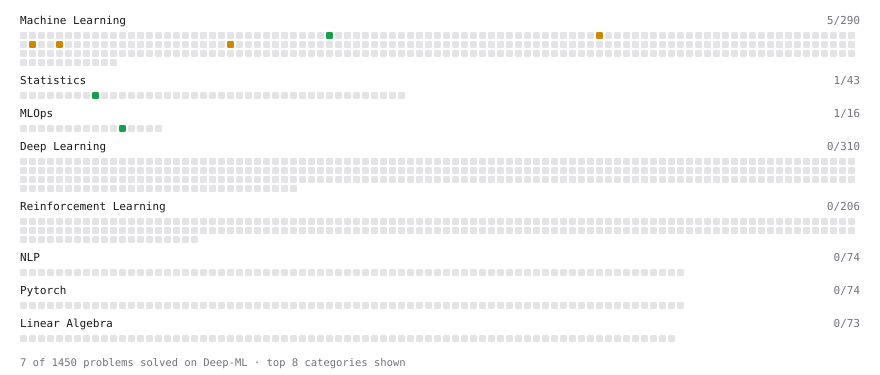

# Deep-ML

My machine learning practice from [Deep-ML](https://www.deep-ml.com). Every solution here was written by hand.

**6** solved · 6 problems · 0 labs · 0 math

[**Browse the interactive portfolio**](https://zannensk.github.io/deep-ml/) to replay this filling in over time.

## Problems

| | Difficulty | Solved | |
| --- | --- | --- | --- |
| [Binary Classification with Logistic Regression](https://www.deep-ml.com/problems/104) | easy | 2026-09-23 | [solution](problems/0104-binary-classification-with-logistic-regression) |
| [Calculate P50/P95/P99 Latency Percentiles](https://www.deep-ml.com/problems/293) | easy | 2026-09-22 | [solution](problems/0293-calculate-p50-p95-p99-latency-percentiles) |
| [Estimate Minimum GPU Count for Model Deployment](https://www.deep-ml.com/problems/412) | easy | 2026-09-21 | [solution](problems/0412-estimate-minimum-gpu-count-for-model-deployment) |
| [Calculate Expected Calibration Error (ECE)](https://www.deep-ml.com/problems/260) | medium | 2026-09-21 | [solution](problems/0260-calculate-expected-calibration-error-ece) |
| [End-to-End Latency Decomposition](https://www.deep-ml.com/problems/413) | medium | 2026-09-22 | [solution](problems/0413-end-to-end-latency-decomposition) |
| [XGBoost Objective Function Calculation](https://www.deep-ml.com/problems/347) | medium | 2026-09-23 | [solution](problems/0347-xgboost-objective-function-calculation) |

---

_This file is regenerated by Deep-ML on every push._
