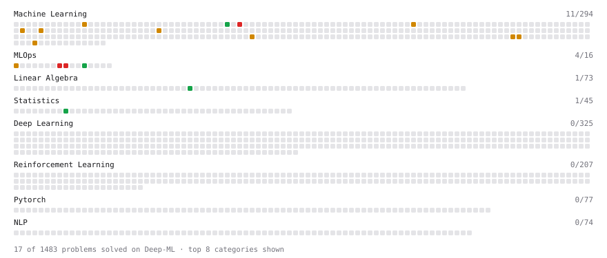

# Deep-ML

My machine learning practice from [Deep-ML](https://www.deep-ml.com). Every solution here was written by hand.

**24** solved · 24 problems · 0 labs · 0 math

[**Browse the interactive portfolio**](https://zannensk.github.io/deep-ml/) to replay this filling in over time.

## Problems

| | Difficulty | Solved | |
| --- | --- | --- | --- |
| [Balance Dataset via Undersampling](https://www.deep-ml.com/problems/1057) | easy | 2026-10-09 | [solution](problems/1057-balance-dataset-via-undersampling) |
| [Binary Classification with Logistic Regression](https://www.deep-ml.com/problems/104) | easy | 2026-09-23 | [solution](problems/0104-binary-classification-with-logistic-regression) |
| [Calculate P50/P95/P99 Latency Percentiles](https://www.deep-ml.com/problems/293) | easy | 2026-09-22 | [solution](problems/0293-calculate-p50-p95-p99-latency-percentiles) |
| [Estimate Minimum GPU Count for Model Deployment](https://www.deep-ml.com/problems/412) | easy | 2026-09-21 | [solution](problems/0412-estimate-minimum-gpu-count-for-model-deployment) |
| [Implement Binary Cross-Entropy Loss](https://www.deep-ml.com/problems/263) | easy | 2026-10-08 | [solution](problems/0263-implement-binary-cross-entropy-loss) |
| [Phi Transformation for Polynomial Features](https://www.deep-ml.com/problems/84) | easy | 2026-09-25 | [solution](problems/0084-phi-transformation-for-polynomial-features) |
| [Random Train/Validation/Test Split with Shuffling](https://www.deep-ml.com/problems/1058) | easy | 2026-10-09 | [solution](problems/1058-random-train-validation-test-split-with-shuffling) |
| [Build a Simple ETL Pipeline (MLOps)](https://www.deep-ml.com/problems/187) | medium | 2026-09-30 | [solution](problems/0187-build-a-simple-etl-pipeline-mlops) |
| [Calculate Expected Calibration Error (ECE)](https://www.deep-ml.com/problems/260) | medium | 2026-09-21 | [solution](problems/0260-calculate-expected-calibration-error-ece) |
| [Contrastive Loss (InfoNCE / SimCLR-style)](https://www.deep-ml.com/problems/384) | medium | 2026-10-09 | [solution](problems/0384-contrastive-loss-infonce-simclr-style) |
| [End-to-End Latency Decomposition](https://www.deep-ml.com/problems/413) | medium | 2026-09-22 | [solution](problems/0413-end-to-end-latency-decomposition) |
| [Feature Hashing Trick for Sparse Features](https://www.deep-ml.com/problems/846) | medium | 2026-09-29 | [solution](problems/0846-feature-hashing-trick-for-sparse-features) |
| [Generate Sorted Polynomial Features](https://www.deep-ml.com/problems/32) | medium | 2026-09-25 | [solution](problems/0032-generate-sorted-polynomial-features) |
| [Implement Gradient Boosting Regressor Step](https://www.deep-ml.com/problems/344) | medium | 2026-09-25 | [solution](problems/0344-implement-gradient-boosting-regressor-step) |
| [Implement Precision-Recall Curve](https://www.deep-ml.com/problems/278) | medium | 2026-10-08 | [solution](problems/0278-implement-precision-recall-curve) |
| [Implement ROC Curve Calculation](https://www.deep-ml.com/problems/276) | medium | 2026-10-08 | [solution](problems/0276-implement-roc-curve-calculation) |
| [Implement Stratified Train-Test Split](https://www.deep-ml.com/problems/275) | medium | 2026-10-09 | [solution](problems/0275-implement-stratified-train-test-split) |
| [Online Mean and Variance with Welford's Algorithm](https://www.deep-ml.com/problems/1144) | medium | 2026-09-29 | [solution](problems/1144-online-mean-and-variance-with-welford-s-algorithm) |
| [Online Rolling Z-Score over a Fixed Window](https://www.deep-ml.com/problems/1143) | medium | 2026-09-29 | [solution](problems/1143-online-rolling-z-score-over-a-fixed-window) |
| [Ranking Metrics: NDCG@k, MRR and MAP@k](https://www.deep-ml.com/problems/1408) | medium | 2026-10-01 | [solution](problems/1408-ranking-metrics-ndcg-k-mrr-and-map-k) |
| [XGBoost Objective Function Calculation](https://www.deep-ml.com/problems/347) | medium | 2026-09-23 | [solution](problems/0347-xgboost-objective-function-calculation) |
| [A/B Test Statistical Analysis for Model Comparison](https://www.deep-ml.com/problems/269) | hard | 2026-09-30 | [solution](problems/0269-a-b-test-statistical-analysis-for-model-comparison) |
| [ML Pipeline DAG Scheduler with Critical Path Analysis](https://www.deep-ml.com/problems/270) | hard | 2026-09-30 | [solution](problems/0270-ml-pipeline-dag-scheduler-with-critical-path-analysis) |
| [Train Logistic Regression with Gradient Descent](https://www.deep-ml.com/problems/106) | hard | 2026-09-30 | [solution](problems/0106-train-logistic-regression-with-gradient-descent) |

---

_This file is regenerated by Deep-ML on every push._
